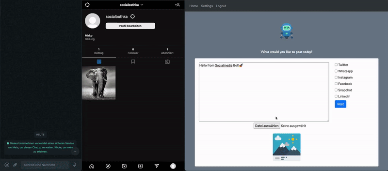
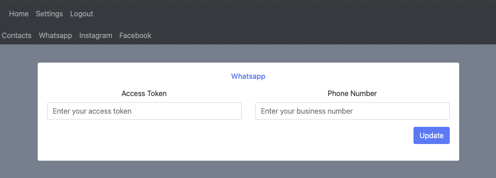
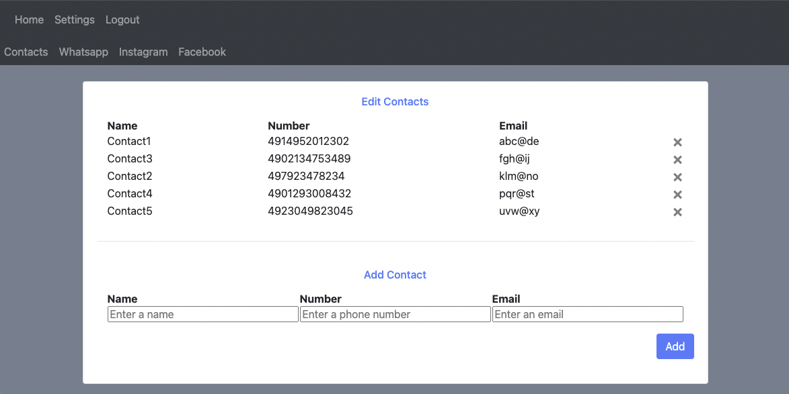

<!-- Improved compatibility of back to top link: See: https://github.com/othneildrew/Best-README-Template/pull/73 -->
<a name="readme-top"></a>
<!--
*** Thanks for checking out the Best-README-Template. If you have a suggestion
*** that would make this better, please fork the repo and create a pull request
*** or simply open an issue with the tag "enhancement".
*** Don't forget to give the project a star!
*** Thanks again! Now go create something AMAZING! :D
-->


<!-- PROJECT SHIELDS -->
<!--
*** I'm using markdown "reference style" links for readability.
*** Reference links are enclosed in brackets [ ] instead of parentheses ( ).
*** See the bottom of this document for the declaration of the reference variables
*** for contributors-url, forks-url, etc. This is an optional, concise syntax you may use.
*** https://www.markdownguide.org/basic-syntax/#reference-style-links
-->
<!-- [![Contributors][contributors-shield]][contributors-url]
[![Forks][forks-shield]][forks-url]
[![Stargazers][stars-shield]][stars-url]
[![Issues][issues-shield]][issues-url]
[![MIT License][license-shield]][license-url]
[![LinkedIn][linkedin-shield]][linkedin-url] -->


<!-- PROJECT LOGO -->
<br />
<div align="center">
  <a href="https://www.flaticon.com/de/kostenloses-icon/roboter_3558860">
    
  </a>

<h3 align="center">HKA Social Media Bot</h3>

  <p align="center">
    A social media bot, capable of posting to Instagram and Whatsapp!
    <br />
    <a href="#readme-toc"><strong>Explore the docs »</strong></a>
    <br />
    <br />
    <a href="#videos-and-showcase">View Demo</a>
    ·
    <!-- <a href="https://github.com/github_username/repo_name/issues">Report Bug</a>
    ·
    <a href="https://github.com/github_username/repo_name/issues">Request Feature</a>
    · -->
    <a href="https://www.flaticon.com/de/kostenloses-icon/roboter_3558860"> Icon </a>
  </p>
</div>

<!-- TABLE OF CONTENTS -->
<a name="readme-toc"></a>
<details>
  <summary>Table of Contents</summary>
  <ol>
    <li>
      <a href="#about-the-project">About The Project</a>
      <!-- <ul>
        <li><a href="#built-with">Built With</a></li>
      </ul> -->
    </li>
    <li>
      <a href="#getting-started">Getting Started</a>
      <ul>
        <li><a href="#installation">Installation</a></li>
        <li><a href="#creating-a-facebook-business-account">Creating a Facebook Business Account</a></li>
        <li><a href="#creating-an-instagram-business-account">Creating an Instagram Business Account</a></li>
        <li><a href="#linking-to-facebook">Linking to Facebook</a></li>
        <li><a href="#getting-an-access-token">Getting an Access Token</a></li>
      </ul>
    </li>
    <li><a href="#usage">Usage</a></li>
    <ul>
        <li><a href="#starting-the-app">Starting the app</a></li>
        <li><a href="#sign-up">Sign up</a></li>
        <li><a href="#updating-credentials">Updating credentials</a></li>
        <li><a href="#creating-a-contact-list">Creating a contact list</a></li>
        <li><a href="#creating-your-first-post">Creating your first post</a></li>
      </ul>
    <li><a href="#next-steps">Next steps</a></li>
    <ul>
        <li><a href="#running-the-app-on-the-local-network">Running the app on the local network</a></li>
        <li><a href="#publishing-the-app-to-the-internet">Publishing the app to the internet</a></li>
      </ul>
    <li><a href="#roadmap">Roadmap</a></li>
    <li><a href="#videos-and-showcase">Videos and showcase</a></li>
    <li><a href="#license">License</a></li>
    <li><a href="#acknowledgments">Acknowledgments</a></li>
  </ol>
</details>


<!-- ABOUT THE PROJECT -->
## About The Project


The HKA Social Media Bot is a tool capable of posting images and messages to various social media websites. Keep your workflow steady with scheduled posts and automatic image generation!

<!-- The HKA Social Media Bot is a command line tool, capable of sending or posting various messages to social media websites. Keep your workflow steady with scheduled posts and automatic image generation! -->

<p align="right">(<a href="#readme-top">back to top</a>)</p>


<!-- ### Built With

* [![Next][Next.js]][Next-url]
* [![React][React.js]][React-url]
* [![Vue][Vue.js]][Vue-url]
* [![Angular][Angular.io]][Angular-url]
* [![Svelte][Svelte.dev]][Svelte-url]
* [![Laravel][Laravel.com]][Laravel-url]
* [![Bootstrap][Bootstrap.com]][Bootstrap-url]
* [![JQuery][JQuery.com]][JQuery-url]

<p align="right">(<a href="#readme-top">back to top</a>)</p> -->


<!-- GETTING STARTED -->
## Getting Started
<!-- 
This is an example of how you may give instructions on setting up your project locally.
To get a local copy up and running follow these simple example steps. -->

<!-- ### Prerequisites

This is an example of how to list things you need to use the software and how to install them.
* [python-prompt-toolkit](https://github.com/prompt-toolkit/python-prompt-toolkit)
  ```sh
  pip install prompt_toolkit
  ```
* [pyimgbox](https://github.com/plotski/pyimgbox)
  ```sh
  pip install pyimgbox
  ``` -->

### Installation

* Clone the repo
   ```sh
   git clone https://github.com/mirkosprojects/socialmedia-bot.git
   ```
* Install dependencies
  ```sh
  cd socialmedia-bot
  pip install -r requirements.txt
  ````
  For more information about the dependencies see [requirements.txt](https://github.com/mirkosprojects/socialmedia-bot/blob/main/requirements.txt)

### Creating a Facebook Business Account

```
HOW TO CREATE OR CONVERT TO A FACEBOOK BUSINESS ACCOUNT
```

### Creating an Instagram Business Account

```
HOW TO CREATE OR CONVERT TO AN INSTAGRAM BUSINESS ACCOUNT
```

### Linking to Facebook
```
HOW TO LINK WHATSAPP AND INSTAGRAM ACCOUNTS TO FACEBOOK
```

### Getting an Access Token

<!-- This program needs your authorization in order to publish to Instagram and Whatsapp. To grant access, login to your Facebook Account and search for HKA SocialMediaBot. 
Click add and grant access to the requested rights.

Once you've granted the required permissions, you will receive an Access Token. Copy this Token and continue with <a href="#usage">Usage</a> -->

```
HOW TO ADD FACEBOOK APP TO ACCOUNT AND RECEIVE ACCESS TOKEN
```

<p align="right">(<a href="#readme-top">back to top</a>)</p>

<!-- USAGE EXAMPLES -->
## Usage

### Starting the app
* Starting the app
   ```sh
   python main.py
   ```
   Once the app has started, it will output an ip adress (usually 127.0.0.1:5000), copy and paste it in your browser

### Sign up
You will be redirected to a Login Page, create a new user account and log in with your email and password.

> **Note**
> The website is running locally on your machine. Email adresses and passwords are stored in a local database at ```socialmedia-bot/instance/database.db```

### Updating credentials
You will have to update your credentials. 
Go to ```Settings``` &rarr; ```Whatsapp```, enter your access token and phone number and click ```Update```.
Repeat this step with your other social media accounts.

### Creating a contact list
Sending messages to whatsapp contacts requires their phone number.
Go to ```Settings``` &rarr; ```Contacts``` and enter the contacts, you wish to message through whatsapp.

### Creating your first post
Go back to ```Home``` and type in a text, you wish to post.
Add an image to the post by clicking on ```Select File``` or drag and drop it.
Select the websites, you wish to post to and click on ```Post```.

> **Note** 
> You can have up to 1000 free whatsapp conversations per month, for more information about pricing, see [pricing](https://developers.facebook.com/docs/whatsapp/pricing/)

> **Note**
> You can post up to 25 pictures on instagram per day

> **Warning**
> In order to post an image through the Graph-API, this program publishes the image on [imgbox.com](https://imgbox.com/). This means, your photos will be available on the internet, even after you delete them from Instagram.

<p align="right">(<a href="#readme-top">back to top</a>)</p>

## Next steps

### Running the app on the local network
You can run this application locally on your network, start it as follows
```sh
python main.py --host=0.0.0.0
```
Any other device on the network can now open the website by typing the given ip adress.

> **Warning**
> Multiple users shouldn't access the same account simultaniously

### Publishing the app to the internet
Cloud hosting providers like [DigitalOcean](https://www.digitalocean.com/) can host websites for you, making it available anywhere and for anyone.

> **Warning**
> Additional security measures might have to be implemented


<p align="right">(<a href="#readme-top">back to top</a>)</p>


<!-- ROADMAP -->
## Roadmap

- [ ] Proof of Concept
    - [x] Whatsapp
    - [x] Instagram
    - [ ] Facebook
    - [ ] Twitter
    - [ ] Snapchat
    - [ ] LinkedIn
- [x] Security
    - [x] Password hashing
    - [x] Encrypt Access Tokens
- [ ] Publish Facebook App
- [ ] Image Generator using templates
- [ ] Scheduling Posts
- [ ] GUI


<!-- See the [open issues](https://github.com/github_username/repo_name/issues) for a full list of proposed features (and known issues). -->

<p align="right">(<a href="#readme-top">back to top</a>)</p>


<!-- CONTRIBUTING -->
<!-- ## Contributing

Contributions are what make the open source community such an amazing place to learn, inspire, and create. Any contributions you make are **greatly appreciated**.

If you have a suggestion that would make this better, please fork the repo and create a pull request. You can also simply open an issue with the tag "enhancement".
Don't forget to give the project a star! Thanks again!

1. Fork the Project
2. Create your Feature Branch (`git checkout -b feature/AmazingFeature`)
3. Commit your Changes (`git commit -m 'Add some AmazingFeature'`)
4. Push to the Branch (`git push origin feature/AmazingFeature`)
5. Open a Pull Request

<p align="right">(<a href="#readme-top">back to top</a>)</p> -->


## Videos and Showcase

### Sending a whatsapp message and posting to instagram using Socialbot



### Changing the whatsapp access token and phone number



### Editing the contacts




<p align="right">(<a href="#readme-top">back to top</a>)</p>

<!-- LICENSE -->
## License

Distributed under the MIT License. See [LICENSE](https://github.com/mirkosprojects/socialmedia-bot/blob/main/LICENSE) for more information.

<p align="right">(<a href="#readme-top">back to top</a>)</p>


<!-- CONTACT -->
<!-- ## Contact

Your Name - [@twitter_handle](https://twitter.com/twitter_handle) - email@email_client.com

Project Link: [https://github.com/github_username/repo_name](https://github.com/github_username/repo_name)

<p align="right">(<a href="#readme-top">back to top</a>)</p> -->


<!-- ACKNOWLEDGMENTS -->
## Acknowledgments

* [Readme Template](https://github.com/othneildrew/Best-README-Template)
* [Flask Template](https://github.com/techwithtim/Flask-Web-App-Tutorial)
* <a href="https://www.flaticon.com/de/kostenlose-icons/bot" title="bot Icons">Bot Icons erstellt von Smashicons - Flaticon</a>

<p align="right">(<a href="#readme-top">back to top</a>)</p>


<!-- MARKDOWN LINKS & IMAGES -->
<!-- https://www.markdownguide.org/basic-syntax/#reference-style-links -->
[contributors-shield]: https://img.shields.io/github/contributors/github_username/repo_name.svg?style=for-the-badge
[contributors-url]: https://github.com/github_username/repo_name/graphs/contributors
[forks-shield]: https://img.shields.io/github/forks/github_username/repo_name.svg?style=for-the-badge
[forks-url]: https://github.com/github_username/repo_name/network/members
[stars-shield]: https://img.shields.io/github/stars/github_username/repo_name.svg?style=for-the-badge
[stars-url]: https://github.com/github_username/repo_name/stargazers
[issues-shield]: https://img.shields.io/github/issues/github_username/repo_name.svg?style=for-the-badge
[issues-url]: https://github.com/github_username/repo_name/issues
[license-shield]: https://img.shields.io/github/license/github_username/repo_name.svg?style=for-the-badge
[license-url]: https://github.com/github_username/repo_name/blob/master/LICENSE.txt
[linkedin-shield]: https://img.shields.io/badge/-LinkedIn-black.svg?style=for-the-badge&logo=linkedin&colorB=555
[linkedin-url]: https://linkedin.com/in/linkedin_username
[product-screenshot]: images/main_menu.png
[Next.js]: https://img.shields.io/badge/next.js-000000?style=for-the-badge&logo=nextdotjs&logoColor=white
[Next-url]: https://nextjs.org/
[React.js]: https://img.shields.io/badge/React-20232A?style=for-the-badge&logo=react&logoColor=61DAFB
[React-url]: https://reactjs.org/
[Vue.js]: https://img.shields.io/badge/Vue.js-35495E?style=for-the-badge&logo=vuedotjs&logoColor=4FC08D
[Vue-url]: https://vuejs.org/
[Angular.io]: https://img.shields.io/badge/Angular-DD0031?style=for-the-badge&logo=angular&logoColor=white
[Angular-url]: https://angular.io/
[Svelte.dev]: https://img.shields.io/badge/Svelte-4A4A55?style=for-the-badge&logo=svelte&logoColor=FF3E00
[Svelte-url]: https://svelte.dev/
[Laravel.com]: https://img.shields.io/badge/Laravel-FF2D20?style=for-the-badge&logo=laravel&logoColor=white
[Laravel-url]: https://laravel.com
[Bootstrap.com]: https://img.shields.io/badge/Bootstrap-563D7C?style=for-the-badge&logo=bootstrap&logoColor=white
[Bootstrap-url]: https://getbootstrap.com
[JQuery.com]: https://img.shields.io/badge/jQuery-0769AD?style=for-the-badge&logo=jquery&logoColor=white
[JQuery-url]: https://jquery.com 